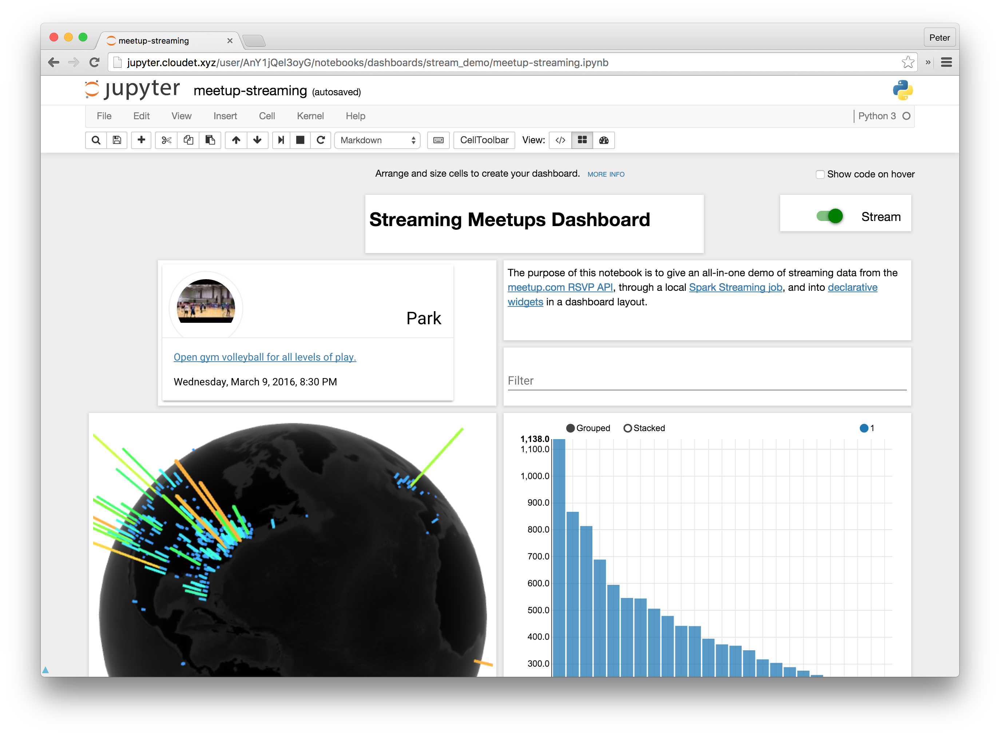

Jupyter Dashboards Layout Extension
===================================

The dashboards layout extension is an add-on for Jupyter Notebook. It lets you arrange your notebook outputs (text, plots, widgets, ...) in grid- or report-like layouts. It saves information about your layouts in your notebook document. Other people with the extension can open your notebook and view your layouts.

For a sample of what's possible with the dashboard layout extension, have a look at the `demo dashboard-notebooks in the project repository <https://github.com/jupyter/dashboards/tree/master/etc/notebooks>`__.

.. toctree::
   :maxdepth: 2
   :caption: User Documentation

   getting-started
   using
   use-cases

.. toctree::
   :maxdepth: 2
   :caption: Contributor Documentation

   development
   maintenance
   metadata

.. toctree::
   :maxdepth: 2
   :caption: About Dashboards Layout

   summary-changes

.. toctree::
   :maxdepth: 2
   :caption: Questions? Suggestions?

   Jupyter mailing list <https://groups.google.com/forum/#!forum/jupyter>
   Jupyter website <https://jupyter.org>
   Stack Overflow - Jupyter <https://stackoverflow.com/questions/tagged/jupyter>
   Stack Overflow - Jupyter-notebook <https://stackoverflow.com/questions/tagged/jupyter-notebook>
   jupyter/help <https://github.com/jupyter/help>

Indices and tables
==================

* :ref:`genindex`
* :ref:`modindex`
* :ref:`search`
