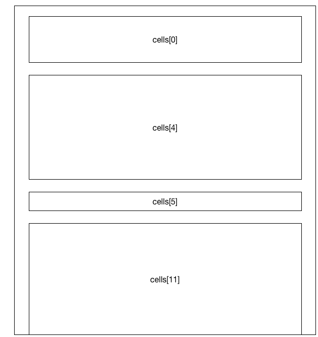
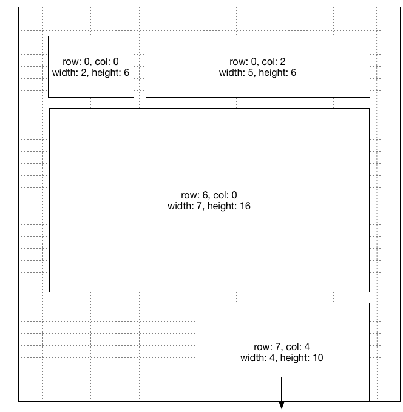

# Dashboard metadata and rendering

This page documents:

1. The fields written to notebook documents (`.ipynb` files) by the
   `jupyter/dashboards` extension
2. The interpretation of these fields in `jupyter/dashboards` and
   `jupyter-incubator/dashboards_server` to render a notebook in a dashboard
   layout.

## Versioning

The dashboard metadata specification is versioned independently of the packages
that use it. The current version of the specification is v1.

Prior to the v1 specification, the dashboard incubator projects read and wrote
a legacy v0 metadata format. The details of this [older spec appear on the
dashboards
wiki](https://github.com/jupyter/dashboards/wiki/Dashboard-Metadata-and-Rendering#spec-v0)
for historical purposes.

## Notebook Fields

The following snippet of JSON shows the fields read and written by the
dashboard projects. A more formal JSON schema appears later in this document.

```
{
  "metadata": {                           // notebook level metadata
    "extensions": {                       // to avoid future notebook conflicts
      "jupyter_dashboards" : {            // pypi package name
        "version": 1,                     // spec version
        "activeView": "<str:views key>",  // initial view to render
        "views": {
          "<str: tool defined ID 1>": {   // tool-assigned, unique layout ID
            "name": "<str>",              // user-assigned, unique human readable name
            "type": "grid",               // layout algorithm to use (grid in this example view)
            "cellMargin": <uint:10>,      // margin between cells in pixels
            "cellHeight": <uint:20>,      // height in pixels of a logical row
            "numColumns": <uint:12>       // total number of logical columns
          },
          "<str: tool defined ID 2>": {   // tool-assigned, unique layout ID
            "name": "<str>",              // user-assigned, unique human readable name
            "type": "report"              // layout algorithm to use (report in this example view)
          }
        }
      }
    }
  },
  "cells": [
    {
      "metadata": {
        "extensions": {
          "jupyter_dashboards": {
            "version": 1,                    // spec version
            "views": {
              "<str: tool defined ID 1>": {  // if present, means the grid layout algorithm has processed this cell
                "hidden": <bool:false>,      // if cell output+widget are visible in the layout
                "row": <uint:0>,             // logical row position
                "col": <uint:0>,             // logical column position
                "width": <uint:6>,           // logical width
                "height": <uint:2>           // logical height
              },
              "<str: tool defined ID 2>": {  // if present, means the report layout algorithm has processed this cell
                "hidden": <bool:false>       // if cell output+widget are visible in the layout
              }
            }
          }
        }
      }
    }
  ]
}
```

## Rendering

A dashboard renderer is responsible for reading the notebook document,
executing cell inputs, and placing *cell outputs* in a *dashboard view*. *Cell
outputs* include anything that Jupyter Notebook 4.x renders in the cell output
subarea or cell widget subarea in response to kernel messages or client-side
events. A *dashboard view* defines how cell outputs are positioned and sized
with respect to one another according to a particular layout algorithm.

The notebook can have multiple dashboard view associated with it in the
`metadata.extensions.jupyter_dashboards.views` field. This specification
defines two *view types*, report and grid, that dictate how a renderer
positions and sizes cells on the page.

### Report View

The `report` type stacks cell outputs top-to-bottom, hiding cells marked as
hidden. The height of each cell varies automatically to contain its content.
The width of all cells is equivalent and set by the renderer.



To display a `metadata.jupyter_dashboards.views[view_id]` with type `report`
properly, the renderer:

* Must execute cell inputs in the order defined by the notebook `cells` array.
* Must not render nor reserve display space for cells that have
  `metadata.extensions.jupyter_dashboards.views[<view id>].hidden=true`.
* Must arrange cell outputs top-to-bottom in order of execution (i.e., stacked
  vertically).
* Must space cell outputs vertically so that they do overlap at any time (e.g.,
  a plot in the top-most cell should not overlap Markdown in the next down cell
  nor any cell below that).
* Should allow interactive widgets in cell outputs to render content that does
  overlap other cells (e.g., popups).
* Should wrap cell outputs that have variable length content (e.g., text) at a
  renderer-determined width (e.g., browser width, responsive container element,
  fixed width).
* Should include a fixed amount of vertical whitespace between cell outputs.

### Grid View

The `grid` type positions cells in a grid with infinitely many rows and a fixed
number of columns. The width and height of each cell is expressed in terms of
these rows and columns. The physical height of each row is a fixed value while
the width of each column is set by the renderer.



Consider a view with tool-assigned ID `view_id` and type `grid` defined in the
notebook-level metadata (i.e.,
`metadata.extensions.jupyter_dashboards.views[view_id]`). Let `view` be a
reference to this notebook-level object. Let `cell_view` be a reference to any
cell-level object keyed by the same `view_id`. To properly display this view,
the renderer:

* Must execute cell inputs in the order defined by the notebook `cells` array.
* Must not render nor reserve display space for cells that have
  `cell_view.hidden=true`.
* Must define a logical grid with an unbounded number of rows and
  `view.numColumns` columns per row.
* Must define a screen viewport with infinite height and a renderer-determined
  width (e.g., browser width, responsive container element, fixed width).
* Must map the grid origin (row zero, column zero) to the top left corner of
  the viewport.
* Must allocate `view.cellHeight` pixels of space in the viewport to each grid
  row.
* Must allocate a fixed, renderer-determined number of pixels in the viewport
  to each grid column.
* Must place a cell's outputs in the `cell_view.row` and `cell_view.col` slot
  in the grid.
* Must allocate `cell_view.width` columns and `cell_view.height` rows of space
  in the grid for a cell's output.
* Must separate each slot in the grid on the screen by `view.cellMargin`
  pixels.
* May clip, scale, wrap, or let overflow cell output that is bigger than its
  allocated space on the screen.

### Other Cases

When presented with a document having no
`metadata.extensions.jupyter_dashboards.views` at the notebook-level, a
renderer:

* Should process the document as if it defines a `report` view with all cells
  visible.
* May persist the implicit all-cells-visible report view to the document.

When processing cells that have no view ID corresponding to the current view
being displayed, a display-only renderer with no authoring capability should
treat such cells as hidden. A renderer with layout authoring capability:

* Should make a best effort attempt at determining the properties for the cell
  in the view based on the content of the cell.
  * e.g., Set `cell_view.hidden=false` if the cell produces no output.
  * e.g., Set `cell_view.row`, `cell_view.col`, `cell_view.width`, and
    `cell_view.height` to values that do not overlap other cells in a grid
    layout.
* Should immediately persist such default values into the document to avoid
  inferring them again in the future.
* Must allow the user to override the computed default values.

## JSON Schema

The following schema expresses the dashboard layout specification as additions
to the existing [notebook format v4
schema](https://github.com/jupyter/nbformat/blob/master/nbformat/v4/nbformat.v4.schema.json).
The schema below omits any untouched portions of the notebook schema for
brevity.

```
{
	"$schema": "http://json-schema.org/draft-04/schema##",
	"description": "IPython Notebook v4.0 JSON schema plus layouts.",
	"properties": {
		"metadata": {
			"properties": {
				"extensions": {
					"description": "Notebook-level namespace for extensions",
					"type": "object",
					"additionalProperties": true,
					"properties": {
						"jupyter_dashboards": {
							"description": "Namespace for jupyter_dashboards notebook metadata",
							"type": "object",
							"additionalProperties": true,
							"properties": {
								"version": {
									"description": "Version of the metadata spec",
									"type": "integer",
									"minimum": 1,
									"maximum": 1
								},
								"activeView": {
									"description": "ID of the view that should render by default",
									"type": "string"
								},
								"views": {
									"description": "View definition",
									"type": "object",
									"additionalProperties": false,
									"patternProperties": {
										"^[a-zA-Z0-9_-]+$": {
											"type": "object",
											"oneOf": [{
												"$ref": "##definitions / jupyter_dashboards / notebook_grid_view "
											}, {
												"$ref": "##definitions / jupyter_dashboards / notebook_report_view "
											}]
										}
									}
								}
							}
						}
					}
				}
			}
		}
	},
	"definitions": {
		"raw_cell": {
			"properties": {
				"metadata": {
					"properties": {
						"extensions": {
							"description": "Cell-level namespace for extensions",
							"type": "object",
							"additionalProperties": true,
							"properties": {
								"jupyter_dashboards": {"$ref": "##definitions/jupyter_dashboards/cell_view"}
							}
						}
					}
				}
			}
		},
		"markdown_cell": {
			"properties": {
				"metadata": {
					"properties": {
						"extensions": {
							"description": "Cell-level namespace for extensions",
							"type": "object",
							"additionalProperties": true,
							"properties": {
								"jupyter_dashboards": {"$ref": "##definitions/jupyter_dashboards/cell_view"}
							}
						}
					}
				}
			}
		},
		"code_cell": {
			"properties": {
				"metadata": {
					"properties": {
						"extensions": {
							"description": "Cell-level namespace for extensions",
							"type": "object",
							"additionalProperties": true,
							"properties": {
								"jupyter_dashboards": {"$ref": "##definitions/jupyter_dashboards/cell_view"}
							}
						}
					}
				}
			}
		},
		"jupyter_dashboards": {
			"notebook_grid_view": {
				"description": "Grid view definition",
				"type": "object",
				"additionalProperties": true,
				"properties": {
					"name": {
						"description": "Human readable name of the view",
						"type": "string"
					},
					"type": {
						"description": "Grid view type",
						"enum": ["grid"]
					},
					"cellMargin": {
						"description": "Margin between cells in pixels",
						"type": "integer",
						"minimum": 0
					},
					"cellHeight": {
						"description": "Height of a logical row in pixels",
						"type": "integer",
						"minimum": 0
					},
					"numColumns": {
						"description": "Total number of logical columns",
						"type": "integer",
						"minimum": 1
					}
				}
			},
			"notebook_report_view": {
				"description": "Report view definition",
				"type": "object",
				"additionalProperties": true,
				"properties": {
					"name": {
						"description": "Human readable name of the view",
						"type": "string"
					},
					"type": {
						"description": "Report view type",
						"enum": ["report"]
					}
				}
			},
			"cell_view": {
				"description": "Namespace for jupyter_dashboards cell metadata",
				"type": "object",
				"additionalProperties": true,
				"properties": {
					"version": {
						"description": "Version of the metadata spec",
						"type": "integer",
						"minimum": 1,
						"maximum": 1
					},
					"views": {
						"description": "Layout information for cell in view",
						"type": "object",
						"additionalProperties": false,
						"patternProperties": {
							"^[a-zA-Z0-9_-]+$": {
								"type": "object",
								"oneOf": [{
									"$ref": "##definitions / jupyter_dashboards / cell_grid_view "
								}, {
									"$ref": "##definitions / jupyter_dashboards / cell_report_view "
								}]
							}
						}
					}
				}
			},
			"cell_grid_view": {
				"description": "Grid view metadata for a cell",
				"type": "object",
				"additionalProperties": true,
				"properties": {
					"hidden": {
						"description": "True if cell is hidden in the view",
						"type": "boolean"
					},
					"row": {
						"description": "Logical grid row",
						"type": "integer",
						"minimum": 0
					},
					"col": {
						"description": "Logical grid column",
						"type": "integer",
						"minimum": 0
					},
					"width": {
						"description": "Width in logical columns",
						"type": "integer",
						"minimum": 1
					},
					"height": {
						"description": "Height in logical rows",
						"type": "integer",
						"minimum": 1
					}
				}
			},
			"cell_report_view": {
				"description": "Report view metadata for a cell",
				"type": "object",
				"additionalProperties": true,
				"properties": {
					"hidden": {
						"description": "True if cell is hidden in the view",
						"type": "boolean"
					}
				}
			}
		}
	}
}
```
