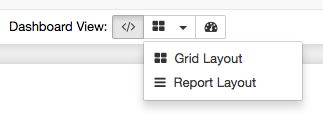
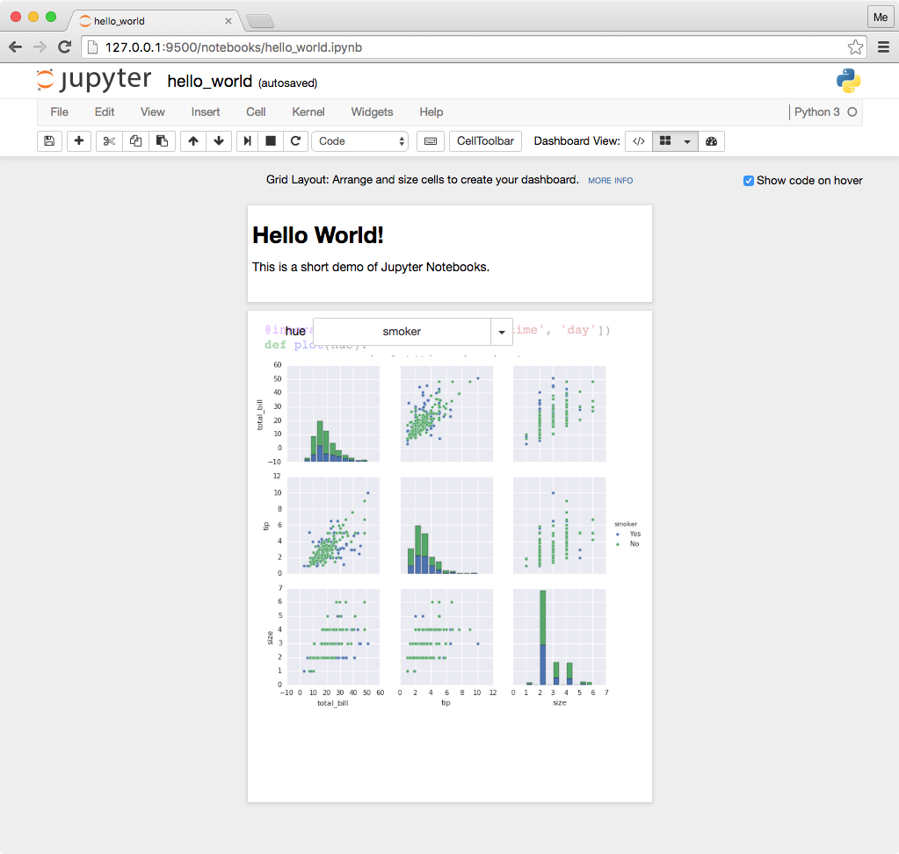
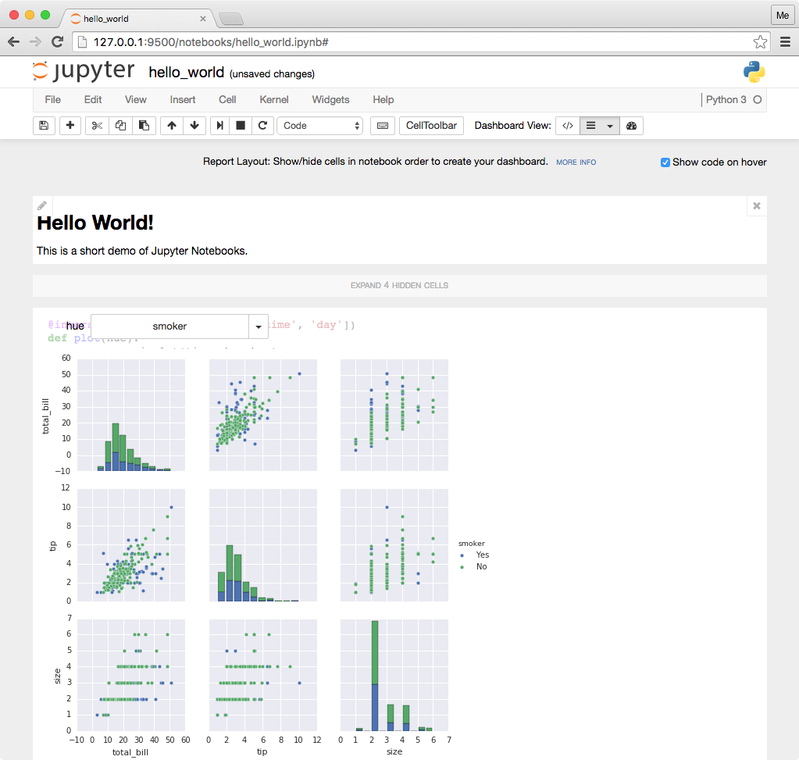
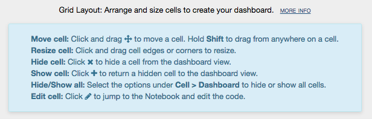
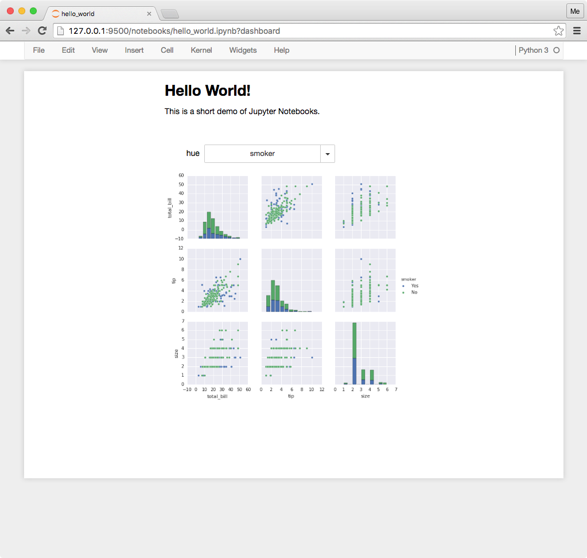
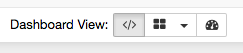

# Creating dashboard layouts

This page provides a brief walkthrough of using the dashboard extension. The
extension provides additional, built-in help about all of the dashboard
features. The steps below include instructions on how to access the help.

Create a new Jupyter notebook document in a language of your choice. Insert
markdown and code into the notebook. Run the cells to generate text, plots,
widgets, etc.

Select either *Grid Layout* or *Report Layout* in the *Dashboard View* toolbar.
Alternatively, use the options in the *View -> Dashboard Layout* menu.

In grid layout, drag handles to resize and move cells in the grid. Click the
buttons to add or remove cells in the layout. Use the *Cell -> Dashboard* menu
items for batch operations.  

In report layout, click buttons to show or hide cells.  

Click *More Info* at the top of the layout view for help with additional
features.  

Click the *Dashboard Preview* button in the toolbar to view and interact with
the cells without the authoring tools. Alternatively, click the *Dashboard
Preview* menu item in the *View* menu.  

Click the *Notebook View* button in the toolbar to return to the notebook
editor. Alternatively, click the *Notebook* menu item in the *View* menu.
 

